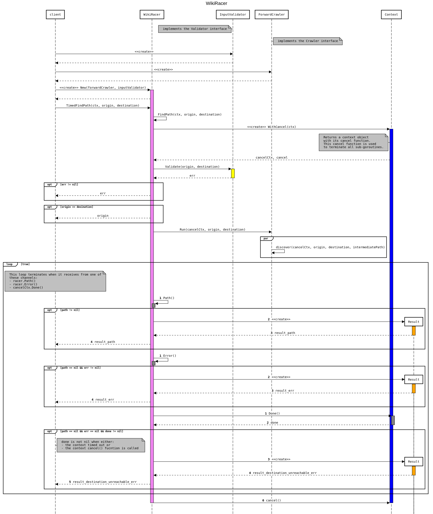

# wikiracer

[ ](https://app.codeship.com/projects/269561)

wikiracer attempts to find a path from one Wikipedia page to another using only links in the pages. The starting page is known as the _origin_ and the target page is known as the _destination_.

In this project, we explore how to:
* Use the `context` package to cancel all running goroutines to avoid leaks.
* Use the `pprof` package to capture and visualize profiling data.
* Use the [MediaWiki API](https://www.mediawiki.org/wiki/MediaWiki) to interact with Wikipedia.

## Table of Content

* [Prerequisites](#prerequisites)
* [Getting Started](#getting-started)
* [Architecture](#architecture)
* [Wikipedia API](#wikipedia-api)
* [Example](#example)
* [Profiling](#profiling)
* [Testing](#testing)
* [LICENSE](#license)

## Prerequisites
The following is a list of software prerequisites for development of this project:

* [golang 1.9.2](https://golang.org/dl/)
* [make](http://tldp.org/HOWTO/Software-Building-HOWTO-3.html)
* [govendor](https://github.com/kardianos/govendor)

## Getting Started
Use the following commands to get started:
```
# clone this repository
$ git clone git@github.com:ihcsim/wikiracer.git

# run all the tests
$ make test

# run the server
$ go run server/main.go
2018/02/13 21:18:02 [INFO] - 1 (main/main.go:27) ▶ Starting up server at port 8080...
```

The following code snippet shows an example of using `curl` as a test client against the wikiracer server:
```
# curl the server from another terminal
$ curl "localhost:8080?origin=Mike%20Tyson&destination=Vancouver"
Path: "Mike Tyson -> 1984 Summer Olympics -> 7-Eleven -> Big C -> Vancouver", Duration: 134.916µs
```

The server outputs log lines that looks like:
```
$ go run main.go
2018/02/13 21:18:02 [INFO] - 1 (main/main.go:27) ▶ Starting up server at port 8080...
2018/02/13 21:18:30 [INFO] - 2 (main/main.go:50) ▶ "Mike Tyson" -> "Vancouver": Starting...
2018/02/13 21:18:30 [INFO] - 3 (main/main.go:66) ▶ "Mike Tyson" -> "Vancouver": SUCCESS. Path: "Mike Tyson -> 1984 Summer Olympics -> 7-Eleven -> Big C -> Vancouver", Duration: 134.916µs
```

## Highlights
Here are some highlights of Wikiracer:

* Concurrent search
* Loops detection
* Goroutine leaks prevention
* Efficient remote API calls

For every link that a page has, the `Forward` crawler creates a new goroutine to crawl and process the linked page. The utilization of goroutines ensures that the crawl isn't blocked on one path. Every goroutine has a record of its ancestral path. When the crawler found the destination page, the entire path is sent to the `WikiRacer` via channel. Errors are also returned to the `WikiRacer` via a separate error channel.

It isn't uncommon that there are more than one paths to get to a page. Some pages are linked together in such a way that they formed a [circular graph](https://en.wikipedia.org/wiki/Cycle_graph). The `Forward` crawler keeps track of all the pages it has visited in a [`sync.Map`](https://golang.org/pkg/sync/#Map). When a child goroutine finds a page, it checks whether this page is already in the map to determine if it has encountered a loop. If a loop is detected, the child goroutine terminates its search and returns.

To avoid goroutines leaks, a `context` is passed from the `WikiRacer.FindPath()` method to the crawler, which listens for cancelation signal using the `context.Done()`method. Right before the `WikiRacer.FindPath()` returns, it calls the `CancelFunc` of the `context`, signaling all the children goroutines to terminate. If desired, user can add a timeout to the `context` of the `WikiRacer.FindPath()` method to ensure that the crawler doesn't go on indefinitely. For more info, refer to the `context` package [docs](https://golang.org/pkg/context/).

To improve the efficiency of calling the remote Wikipedia API, multiple pages can be retrieved with one query by appending all the page titles to the `titles` query parameter, using the `|` to delimit the titles.

## Architecture
All the wikiracer code are found in the top-level `wikiracer` package.

The two main APIs are:
```
TimedFindPath(ctx context.Context, origin, destination string) *Result

FindPath(ctx context.Context, origin, destination string) *Result
```

The `WikiRacer` is composed of a `Crawler` and a `Validator`. The `Crawler` embodies the page-crawling algorithm and the `Validator` performs validation on the user-provided inputs.


An uni-directional crawler implementation known as `Forward` can be found in the `wikiracer/internal/crawler` package.

In short, for every page `P` that the `Forward` crawler encounters, it creates a goroutine to process `P`. Inside the goroutine,

1. `P` is appended to the sequence of pages in the `intermediate` path.
1. `P` is marked as a visited page.
1. If `P` is the destination page, the `intermediate` path is returned.
1. If `P` isn't the destination page and has no links, the goroutine terminates.
1. Otherwise, for every link of `P`, the goroutine creates a new goroutine to crawl that linked page.

An input validator implementation can be found in the `wikiracer/internal/validator` package.

This is the sequence diagram showing all the method calls between a client, the wikiracer, validator, crawler and context objects.



## Example
The following is a code example on how to use the `Wikiracer` with timeout.
```
package main

import (
  "github.com/ihcsim/wikiracer"
  "github.com/ihcsim/wikiracer/test"
  "time"
  "context"
)

func main() {
  // create the racer to query the in-memory mock wiki
  mockWiki := test.NewMockWiki()
  racer := wikiracer.New(crawler.NewForward(mockWiki), &validator.InputValidator{mockWiki})

  // set up context with timeout
  result := make(chan *Result)
  ctx, cancel := context.WithTimeout(context.Background(), time.Second)
  defer cancel()
  go func() {
    result <- racer.FindPath(ctx, testCase.origin, testCase.destination)
  }()

  select {
  case actual := <-result:
    // do something with the path, handle errors etc.
    if actual.Err != nil {
       ...
    }

    path, err := ioutil.ReadAll(actual.Path)

  case <-ctx.Done():
    // handle timeout etc.
  }
}
```

## Wikipedia API
Integration with the Wikipedia API is done with the [mediawiki](https://github.com/sadbox/mediawiki) library at the endpoint https://en.wikipedia.org/w/api.php

The following query parameters are appended to the endpoint to query for links found in a page:

Query Parameter  | Description
---------------- | -----------
`action=query`   | Use the `query` action to retrieve information about Wikipedia pages.
`titles=<titles>`| Specify the title of the page to retrieve. Multiple page titles can be provided by delimiting with the ` | ` character.
`prop=links`     | Set the interested property to just links within the page. More info [here](https://www.mediawiki.org/wiki/API:Properties).
`pllimit=max`    | Set the number of links to be returned to the maximum. Default to 500. More info [here](https://www.mediawiki.org/wiki/API:Links).
`plnamespace=0`  | Only retrieve links to pages in the `0` (or `main`) namespace. More info [here](https://www.mediawiki.org/wiki/Extension_default_namespaces).
`redirects`      | Enable redirects to pages which are referred to by multiple names, alternative punctuation, capitalization or spellings. More info [here](https://www.mediawiki.org/wiki/Help:Redirects).
`format=json`    | The result should be set to the JSON format.
`formatversion=2`| New format as of MediaWiki version >= 1.25. More info [here](https://www.mediawiki.org/wiki/API:Data_formats#JSON_parameters).
`utf8`           | Encodes most non-ASCII characters as UTF-8 instead of replacing them with hexadecimal escape sequences. More info [here](https://www.mediawiki.org/wiki/API:Data_formats#JSON_parameters).

Often a response may not contain all the results of a query. If more results can be retrieved, the response usually contains the `continue` key. The value of this key (usually a JSON object) can be appended to the endpoint to retrieve the remaining query results.

## Logging
The server's log level can be altered using the environment variable `WIKIRACER_LOG_LEVEL`. The list of support log levels are:
* CRITICAL
* ERROR
* WARNING
* NOTICE
* INFO
* DEBUG

## Profiling
To access the pprof visualization tool, navigate to http://localhost:6060/debug/pprof from your web browser.

## Testing
The `test` package provides an in-memory mock wiki which can be used for testing.

The following diagram depicts how all the pages in the mock wiki are linked.


Notice that:

* _Mike Tyson_ is the root page.
* _Vancouer_ has multiple parents.
* There are two paths from _Mike Tyson_ to _1984 Summer Olympics_.
* There is a loop from _1984 Summer Olympics_ through _Vancouver_ back to _1984 Summer Olympics_.

## LICENSE
Refer [LICENSE](LICENSE) file.
